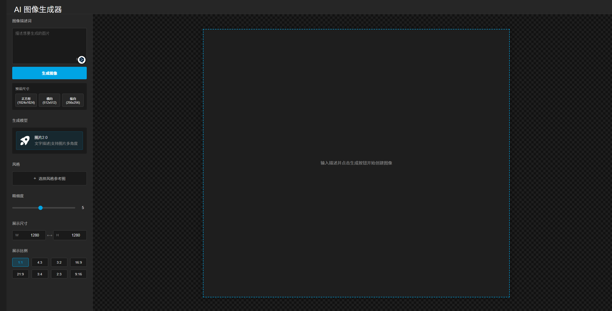

# AI图像生成器

一个基于Vue 3的AI图像生成应用，支持多种AI模型生成图像。

## 应用预览



## 功能特点

- 支持多种AI模型：DALL-E 3、DALL-E 2、即梦API等
- 多种图像尺寸和宽高比选项
- 图像质量调节
- 提示词优化功能
- 图像扩展功能
- 图像历史记录

## CORS问题解决方案

本项目使用代理服务器解决跨域请求问题，特别是当从HTTPS域名访问HTTP API时的问题。

### 本地开发

在本地开发环境中，我们使用Express服务器作为代理：

1. 所有API请求都通过本地Express服务器代理
2. 图片请求通过专门的代理路由处理

### 生产环境部署

在Vercel等平台部署时，使用以下解决方案：

1. 使用Vercel的路由配置进行API代理
2. 添加CORS头信息允许跨域请求
3. 图片代理通过服务器端函数处理

## 安装与运行

```bash
# 安装依赖
npm install

# 启动开发服务器（包含代理服务）
npm run dev

# 构建生产版本
npm run build

# 预览生产版本
npm run preview
```

## 代理配置

本项目配置了以下代理路径：

- `/api/jimeng/*` -> `http://39.104.18.10:8000/v1/*`
- `/api/deepseek/*` -> `https://api.deepseek.com/*`
- `/api/coze/*` -> `https://api.coze.cn/*`
- `/api/deepseek2/*` -> `http://39.104.18.10:8001/*`
- `/api/proxy?url=图片URL` -> 代理访问图片内容

## 技术栈

- Vue 3
- Vite
- Axios
- Express (用于开发环境代理)

## 注意事项

- 本地开发时使用`npm run dev`命令启动包含代理的服务器
- 部署到Vercel时，确保配置了正确的环境变量
- 图片跨域问题已通过代理服务器解决

## 配置说明

在 `src/apis/imageGenerator.js` 中配置您的 OpenAI API 密钥：

```js
setApiKey('你的API密钥');
```

## 许可证

MIT
